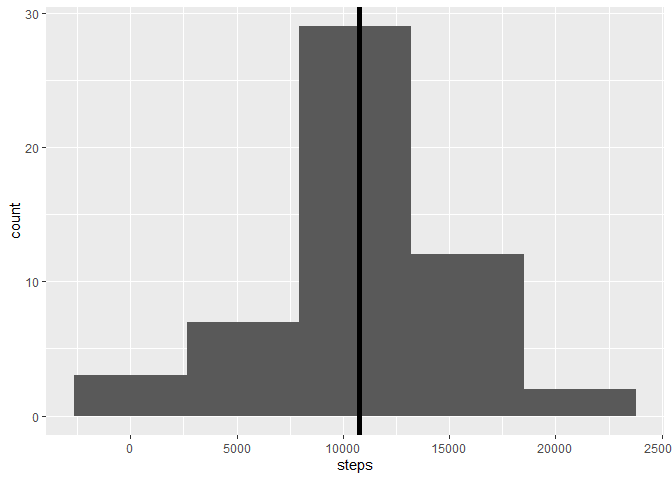
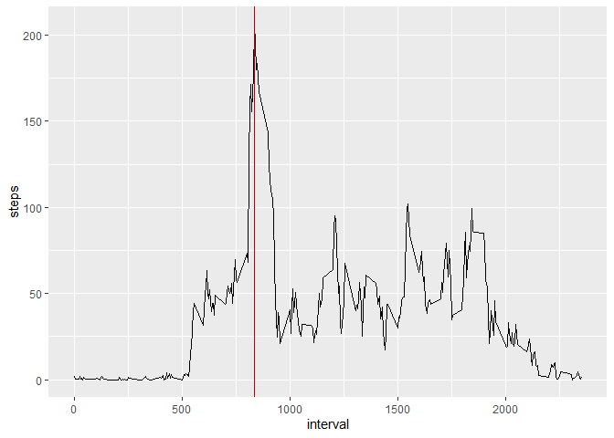
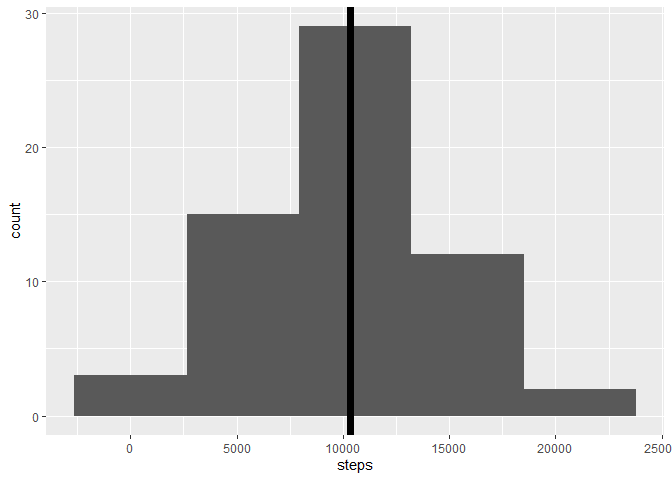
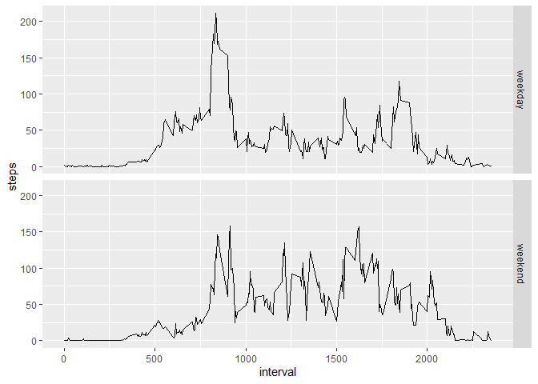

```
## Loading required package: ggplot2
```

## Loading and preprocessing the data
The dataset for the current project can be found at [Activity Monitoring Data](https://d396qusza40orc.cloudfront.net/repdata%2Fdata%2Factivity.zip).

Extract `activity.csv` from `repdata_data_activity.zip` which is downloaded from [Activity Monitoring Data](https://d396qusza40orc.cloudfront.net/repdata%2Fdata%2Factivity.zip) if it is not already present in the working directory.

```r
    url            <- "https://d396qusza40orc.cloudfront.net/repdata%2Fdata%2Factivity.zip"
    compressedName <- "repdata_data_activity.zip"
    datasetName    <- "activity.csv"
    
    ##  Check for the presence of compressedName & datasetName. If not present, download.
    if (!(file.exists(compressedName) | file.exists(datasetName))) 
        download.file(url, compressedName)
    ##  Check for presence of datasetName. If not present, extract.
    if (!(file.exists(datasetName))) unzip(compressedName)
```

Read the data from `activity.csv` into `activity` (dataFrame).

```r
    activity        <- read.csv(datasetName)
    activity$date   <- as.Date(activity$date) 
```

## What is mean total number of steps taken per day?
Aggregate the given data into a data frame with total steps and date as columns named  `stepsPerDay`. Ignore any data with `NA`.

```r
    stepsPerDay <- aggregate(steps ~ date, activity, sum)
```

Calculate the `mean` and the `median` of the total number of steps.

```r
    meanDailySteps      <- mean(stepsPerDay$steps)
    medianDailySteps    <- median(stepsPerDay$steps) 
```

Plot a `histogram` for `Total steps taken per day`.

```r
    graph <- ggplot(stepsPerDay, aes(x = steps)) + geom_histogram(bins = 5)
    graph <- graph + geom_vline(xintercept = meanDailySteps, size = 2)
    graph <- graph + geom_vline(xintercept = medianDailySteps, size = 2)
    graph
```

<!-- -->

The mean total number of steps taken per day is 10766.1886792.
The median of the same is 10765.

## What is the average daily activity pattern?
Aggregate the given data into a data frame with average steps and interval as columns named  `avgStepsPerInt`. Ignore any data with `NA`.

```r
    avgStepsPerInt <- aggregate(steps ~ interval, activity, mean)
```

Calculate the `max` of the average steps.

```r
    rowindex    <- which.max(avgStepsPerInt$steps)
    maxAvgSteps <- avgStepsPerInt[rowindex,]$steps
    maxInterval <- avgStepsPerInt[rowindex,]$interval
```

Plot a `line graph` for `Average steps taken per Interval`.

```r
    graph <- ggplot(avgStepsPerInt, aes(x = interval, y = steps)) + geom_line()
    graph <- graph + geom_vline(aes(xintercept = maxInterval), colour="#BB0000")
    print(graph)
```

<!-- -->

The maximum average steps taken in an interval is 206.1698113.
The maximum average steps taken in the interval 835.

## Imputing missing values
Calculate the number of rows containing `NA`.

```r
    nMissingRows <- sum(is.na(activity$steps))
```

There are 2304 in the given data `activity`.

Create a new `dataFrame` to store the new imputed Data `imputedActivity`

```r
    imputedActivity <- activity
```
Fill in the `NA` spaces with the average steps taken in that interval.

```r
    naIntervals <- activity[is.na(activity$steps),3]
    imputedActivity[is.na(imputedActivity$steps),1] <- avgStepsPerInt[naIntervals%/%5+1,2]
```

Aggregate the given data into a data frame with total steps and date as columns named  `stepsPerDay`. Ignore any data with `NA`.

```r
    imputedStepsPD <- aggregate(steps ~ date, imputedActivity, sum)
```

Calculate the `mean` and the `median` of the total number of steps.

```r
    imputedMeanDS      <- mean(imputedStepsPD$steps)
    imputedMedianDS    <- median(imputedStepsPD$steps) 
```

Plot a `histogram` for `Total steps taken per day`.

```r
    graph <- ggplot(imputedStepsPD, aes(x = steps)) + geom_histogram(bins = 5)
    graph <- graph + geom_vline(xintercept = imputedMeanDS, size = 2)
    graph <- graph + geom_vline(xintercept = imputedMedianDS, size = 2)
    print(graph)
```

<!-- -->

The imputed mean total number of steps taken per day is 10282.1429013.
The imputed median of the same is 10395.

Both the mean and median calculated from the imputed values are lower by a small amount.

The mean is lower by 484.0457779.
The median is lower by 370.

## Are there differences in activity patterns between weekdays and weekends?
Divide the days into weekdays and weekends and add the column dayofweek to `activity`.

```r
    logicDayofWeek <- weekdays(imputedActivity$date) %in% c("Sunday", "Saturday")
    imputedActivity$dayofweek <- "weekday"
    imputedActivity[logicDayofWeek,4] <- "weekend"
    imputedActivity$dayofweek <- as.factor(imputedActivity$dayofweek)
```

Aggregate the given data into a data frame with average steps and interval as columns named  `avgStepsPerInt`. Ignore any data with `NA`.

```r
    avgStepsPerIntW <- aggregate(steps ~ interval + dayofweek, imputedActivity, mean)
```

Plot a `line graph` for `Average steps taken per Interval during weekdays and weekends`.

```r
    graph <- ggplot(avgStepsPerIntW, aes(x = interval, y = steps)) + geom_line()
    graph <- graph + facet_grid(dayofweek~.)
    print(graph)
```

<!-- -->

#### End of the Document
